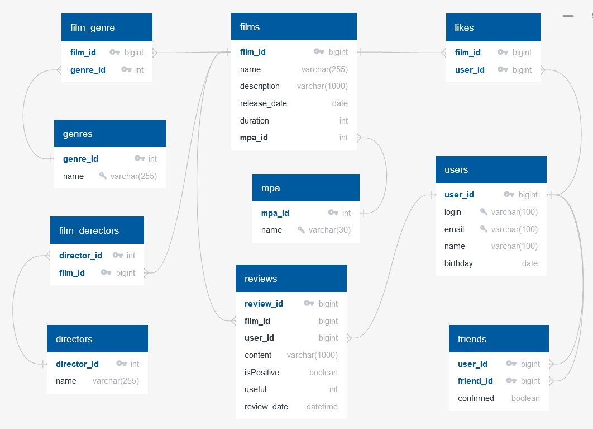

# java-filmorate
## Проект "Фильморейт" - рейтинг фильмов

### ЕR-диаграмма

## Описание диаграммы

### Users
Содержит данные о пользователях
 
Таблица включает поля:
* первичный ключ **user_id** - идентификатор пользователя
* **email** - адрес электронной почты пользователя
* **name** - имя пользователя
* **birthday** - день рождения пользователя

### Film
Содержит данные о фильмах
 
Таблица включает поля:
* первичный ключ **film_id** - идентификатор фильма
* **name** - название фильма
* **description** - описание фильма
* **release_date** - дата выхода фильма
* **duration** - продолжительность фильма
* **rating** - рейтинг ассоциации MPA

### Likes
Содержит информацию о реакциях пользователей к фильму
 
Таблица включает поля:
* составной первичный ключ **film_id** - идентификатор фильма 
* составной первичный ключ **user_id** - идентификатор пользователя, который поставил лайк фильму

### Friends
Содержит информацию о друзьях пользователей
 
Таблица включает поля:
* составной первичный ключ **user_id** - идентификатор пользователя
* составной первичный ключ **friend_id** - идентификатор друга пользователя
* **confirmed** - статус подтвеждения запроса на дружбу

### Genre
Содержит данные о жанрах фильмов
 
Таблица включает поля:
* первичный ключ **genre_id** - идентификатор жанра
* **name** - название жанра

### Rating
Содержит данные о рейтингах MPA, определяющих возрастное ограничение
 
Таблица включает поля:
* первичный ключ **rating_id** - идентификатор рейтинга
* **name** - название рейтинга:
    * **G** - у фильма нет возрастных ограничений
    * PG — детям рекомендуется смотреть фильм с родителями
    * PG-13 — детям до 13 лет просмотр не желателен
    * R — лицам до 17 лет просматривать фильм можно только в присутствии взрослого
    * **NC-17** — лицам до 18 лет просмотр запрещён

### Film_genre
Содержит информацию к каким жанрам относится фильм
 
Таблица включает поля:
* составной первичный ключ **film_id** - идентификатор фильма
* составной первичный ключ **genre_id** - идентификатор жанра